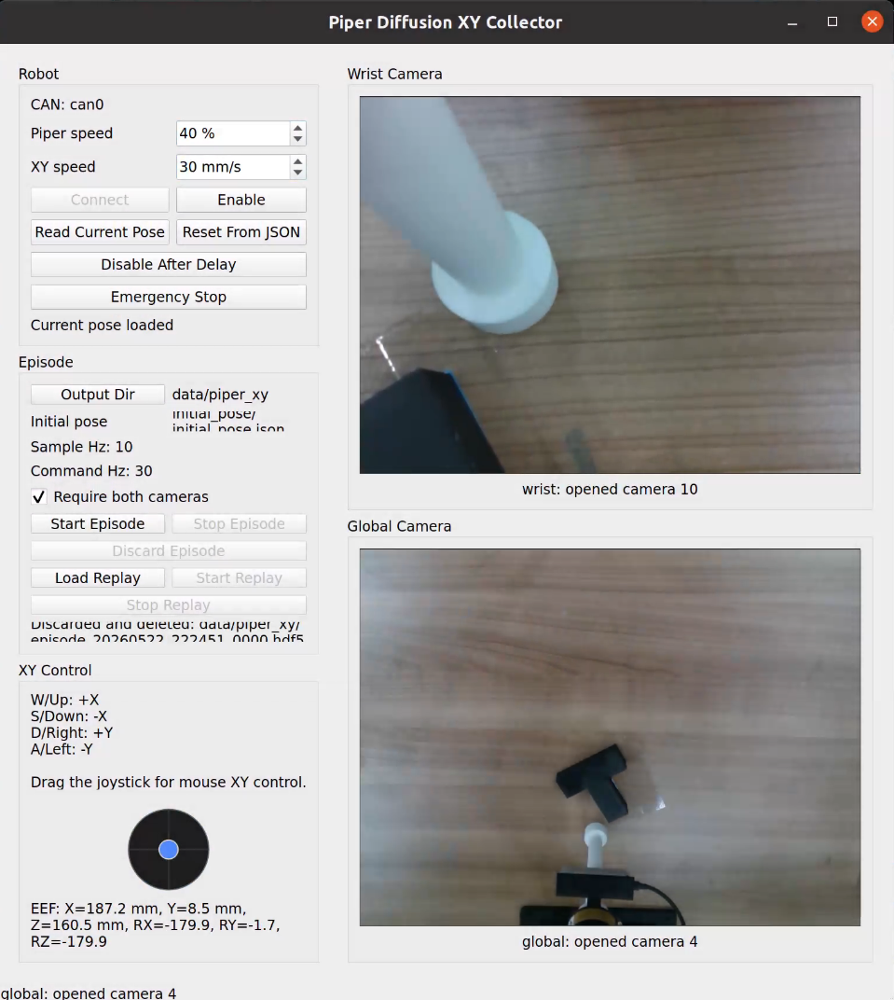
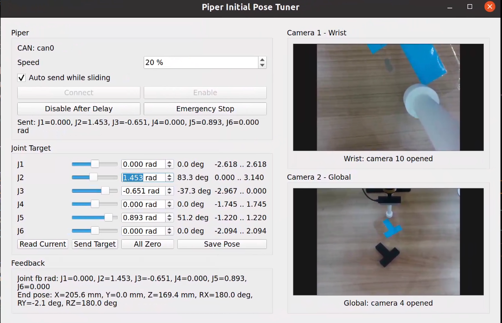

# 机器人数据采集系统

这个仓库用于沉淀真机数据采集工具。当前已经完成的是 Piper 机械臂面向 Diffusion Policy / push-T 类任务的数据采集系统。

## Piper 数采展示

### Diffusion XY Collector



### Initial Pose Tuner



## 当前模块

```text
.
├── piper/      # Piper 机械臂数采系统
└── data/       # 本地采集数据
```

`piper/` 目前包含：

- 初始姿态和工作平面标定工具
- 双相机实时预览
- XY 平面遥控采集
- HDF5 / 视频 / 图片序列多格式保存
- 轨迹删除和轨迹回放
- 标准化 Diffusion Policy 训练数据 schema

详细运行方式见：

```text
piper/README.md
```

克隆后需要拉取 Piper SDK 子模块：

```bash
git submodule update --init --recursive
```

数据不放在 Git 仓库里。`data/` 已经被 `.gitignore` 忽略，后续采集数据建议单独上传到 Hugging Face Dataset。
